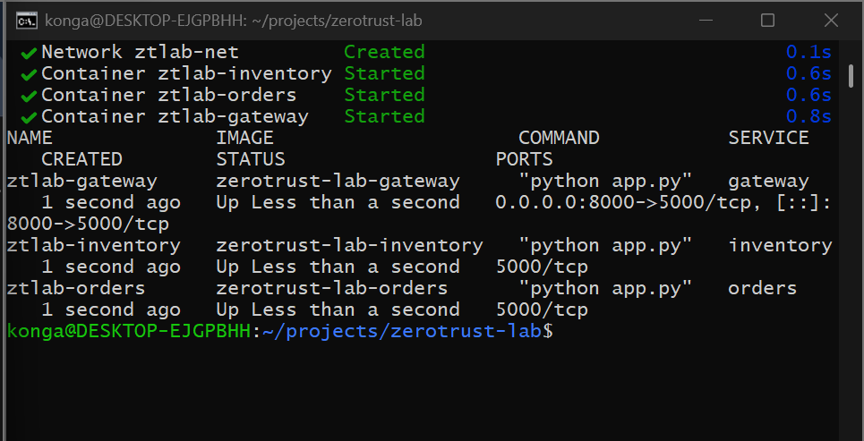
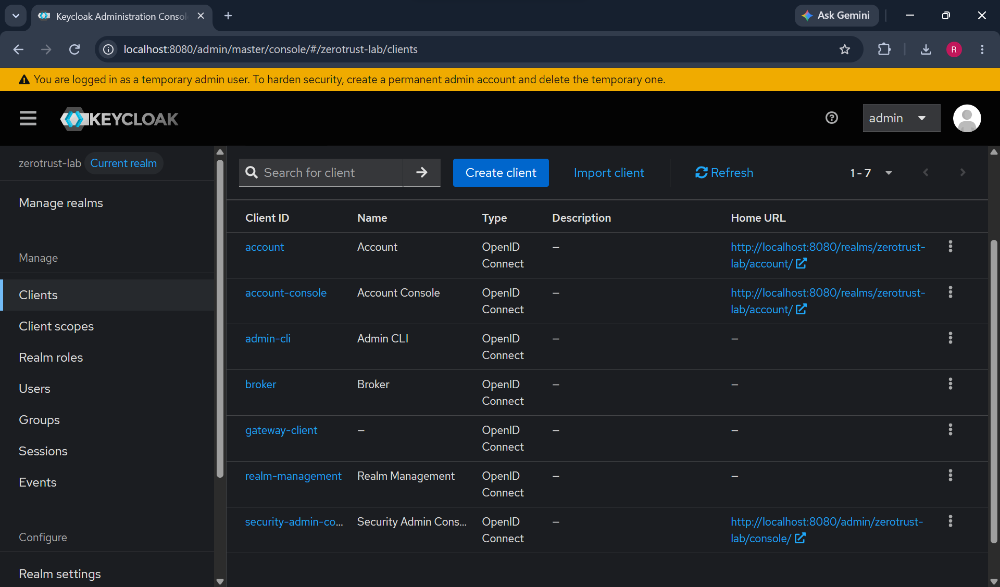
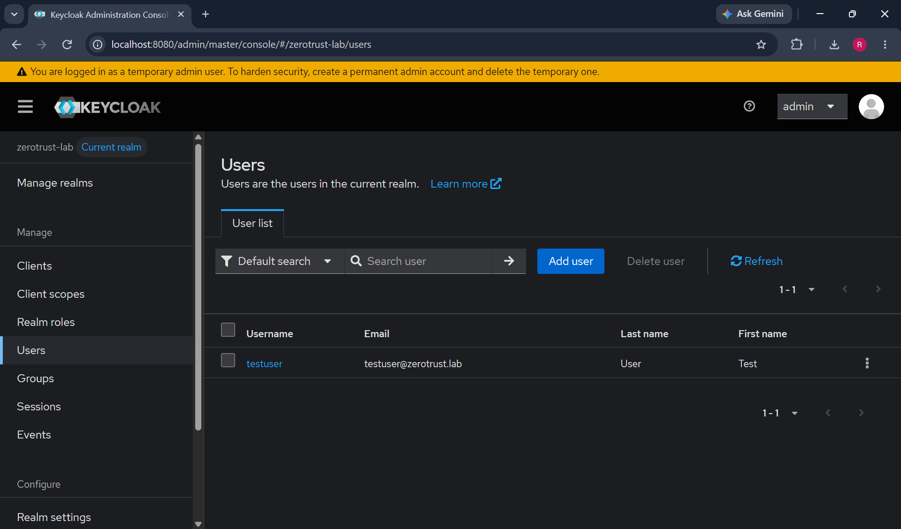
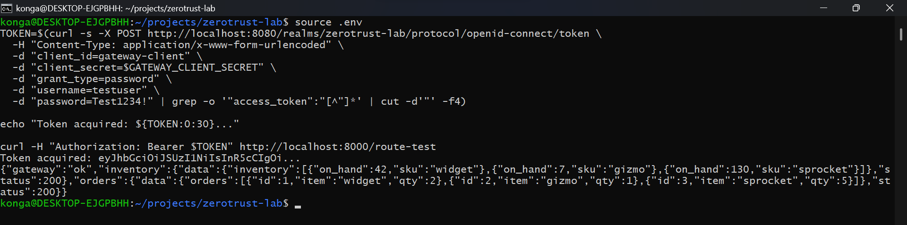
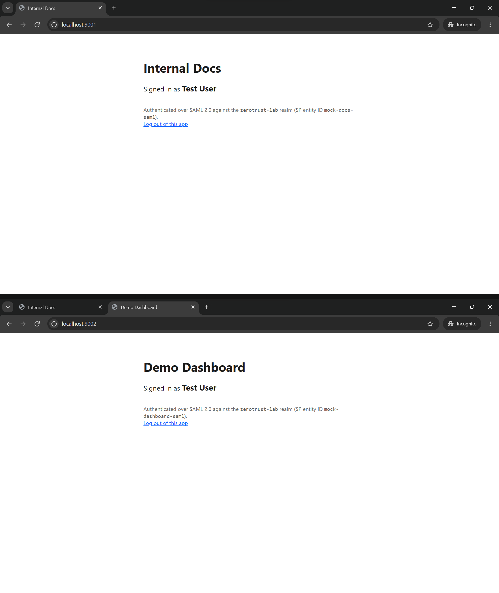
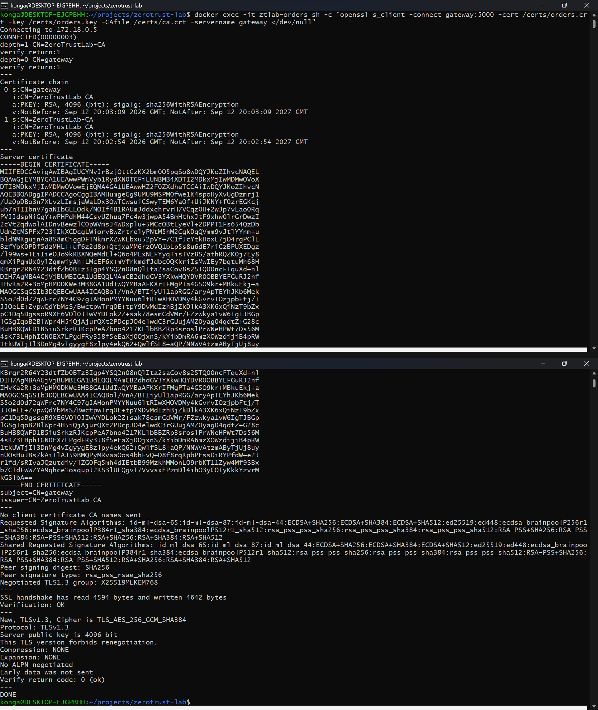
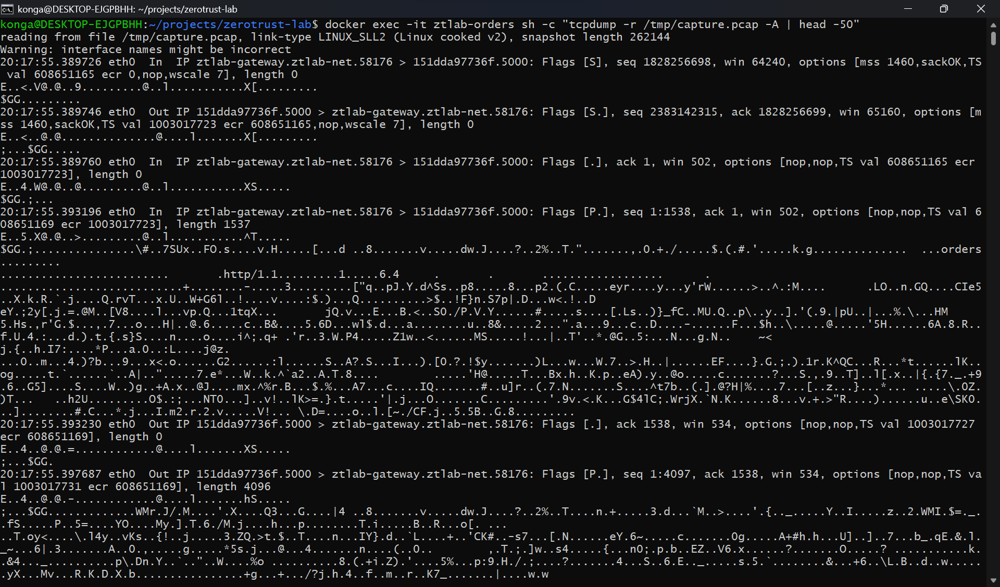
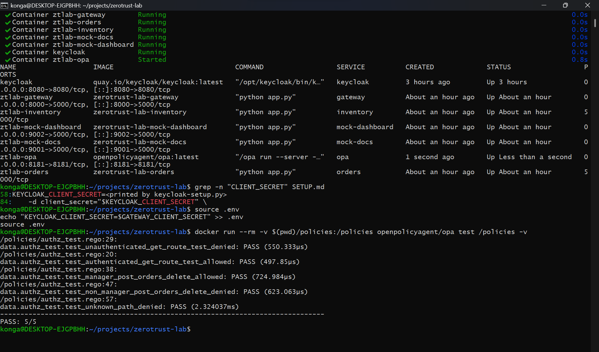
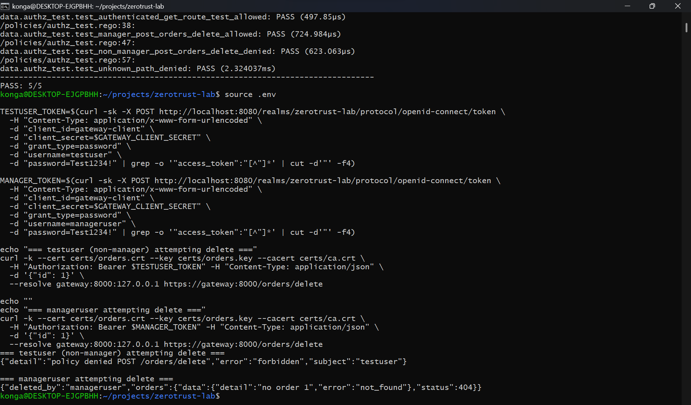
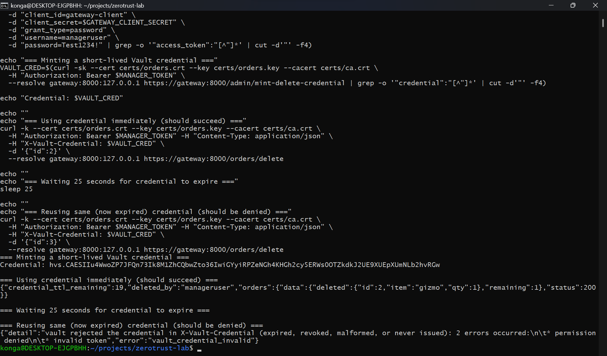

# zerotrust-lab

A local zero trust test bed. Three microservices (`gateway`, `orders`, `inventory`)
run behind an enforcing gateway that has to satisfy four independent layers before
a request reaches an upstream service: mutual TLS, an OIDC token from Keycloak, an
Open Policy Agent decision, and, for privileged actions, a short-lived HashiCorp
Vault credential. Two mock SAML service providers sit alongside it to demonstrate
federated single sign-on against the same realm.

| Component | Role | Address |
| --- | --- | --- |
| `gateway` | Policy enforcement point; terminates mTLS, validates tokens | `https://localhost:8000` |
| `orders`, `inventory` | Upstream services, mTLS only, no published port | internal to `ztlab-net` |
| Keycloak | Identity provider (OIDC + SAML 2.0) | `localhost:8080` |
| Open Policy Agent | Policy decision point | `localhost:8181` |
| Vault | Just-in-time credential issuer | `localhost:8200` |
| `mock-docs`, `mock-dashboard` | SAML service providers | `localhost:9001`, `localhost:9002` |

`SETUP.md` has the commands to bring the stack up and reproduce everything below.
Once the stack is running, `./verify.sh` re-runs the core checks (services up,
plaintext refused, OIDC enforcement, mTLS, the Rego tests, a live OPA allow and
deny, and a Vault credential used inside its TTL) in one pass, printing a
`PASS` or `FAIL` line per check and exiting non-zero if any fails. See
`SETUP.md` §8.

## Screenshots

The walkthrough below follows the order the lab is built up in `SETUP.md`: stand up
the services, provision identity, prove authentication, then layer authorization,
transport security and time-bound privilege on top.

### 1. The stack comes up

The test bed is defined entirely in `docker-compose.yml` and started with
`docker compose up --build`. The gateway is the only service published to the host,
on port 8000 (mapped to its internal 5000); `orders` and `inventory` are attached to
the `ztlab-net` bridge network with no port mapping at all, so there is no path to
them from the host. This is the network precondition the rest of the lab depends on:
every request to an upstream service has to pass through the gateway, because there
is nowhere else to send it.

### 2. Keycloak realm configuration

Keycloak starts with an empty realm list, so the `zerotrust-lab` realm is pushed in
over the Admin REST API by `./keycloak-setup.py`. The script imports the realm,
configures `gateway-client` with direct access grants enabled, creates the `manager`
realm role, and creates two accounts that sit on either side of the authorization
policy: `testuser` with no extra roles and `manageruser` holding `manager`. The
clients view confirms `gateway-client` exists alongside the two SAML clients; the
users view confirms the test accounts the later steps authenticate as.

### 3. OIDC token request and authenticated call

With the realm provisioned, a token is requested straight from Keycloak's token
endpoint using the resource owner password grant: a `POST` to
`/realms/zerotrust-lab/protocol/openid-connect/token` with `grant_type=password`,
the `gateway-client` credentials, and the test user's password. The returned access
token is then presented to the gateway's `/route-test` endpoint as a bearer token.
The same endpoint returns 401 without a token, so the 200 here is the token doing
the work: authentication is enforced at the gateway rather than assumed from network
position.

### 4. SAML single sign-on across two service providers

`mock-docs` (port 9001) and `mock-dashboard` (port 9002) are separate SAML 2.0
service providers, each registered as its own Keycloak client with its own entity ID,
ACS URL and session cookie name. Visiting `mock-docs` in a clean browser profile
redirects to Keycloak and prompts for credentials; visiting `mock-dashboard`
afterwards in the same browser renders immediately as signed in. No second login
prompt appears, because the browser still round-trips through Keycloak but the realm
session cookie from the first login is still valid, so Keycloak issues a fresh
assertion instead of asking for credentials. The distinct cookie names matter: with
a shared one the second app could read the first app's session and the demo would
prove nothing.

### 5. Mutual TLS handshake

Service-to-service traffic is mutually authenticated: `gateway`, `orders` and
`inventory` each present a certificate signed by the lab CA in `certs/ca.crt` and
each require one from the caller. The handshake is inspected directly with
`openssl s_client`, which shows the peer certificate chain, the acceptable client CA
the server advertises, and the verification result. Both directions validate: the
client checks the server's chain to the CA, and the server rejects any caller that
cannot present a certificate the same CA signed. Identity here is the certificate,
not the source address.

### 6. Encrypted traffic on the wire

To confirm the handshake above is not just configuration, traffic on the bridge
network is captured with `tcpdump` while a request flows between services. The
capture shows the TLS records, handshake then application data, with no readable
HTTP method, path, header or body anywhere in the payload. Contrasted with the
plaintext baseline taken before mTLS was introduced, where the same request was
fully legible in the capture, this is the difference between traffic that is
protected on an untrusted network and traffic that merely sits on a private one.

### 7. Policy unit tests

Authorization rules live in `policies/authz.rego` and are tested independently of
the running stack with `opa test policies/ -v`. Seven tests cover both sides of each
rule: authenticated read allowed and unauthenticated read denied, manager delete
allowed and non-manager delete denied, manager mint allowed and non-manager mint
denied, plus an unknown path falling through to the default deny. All seven pass.
Because the policy is data rather than gateway code, a rule can be changed and
re-verified without rebuilding or restarting the service.

### 8. Live policy decision

The same rules are then exercised against the running gateway, which calls OPA as
its decision point on every request. Two users hit the identical protected endpoint
with identical requests, differing only in the roles carried by their token:
`testuser` is denied with a 403, and `manageruser` is allowed through. Nothing about
the request path or the network changed between the two calls: the decision is made
per request from the token's claims, which is what makes the policy dynamic rather
than a static access list.

### 9. Just-in-time Vault credential

Passing policy is still not enough for a privileged action. Deleting an order
requires a second gate: a credential minted on demand from Vault's `delete-order`
AppRole, whose token carries a 20 second TTL that cannot be renewed past its maximum.
The screenshot shows the credential being minted, used successfully inside its TTL
with the remaining seconds reported in the response, and then rejected once it has
expired. Standing privilege is replaced by privilege that exists only for the window
in which it is used.

---

`ZERO_TRUST_MAPPING.md` maps these controls, and the lab's known gaps, to the seven
NIST SP 800-207 tenets.
